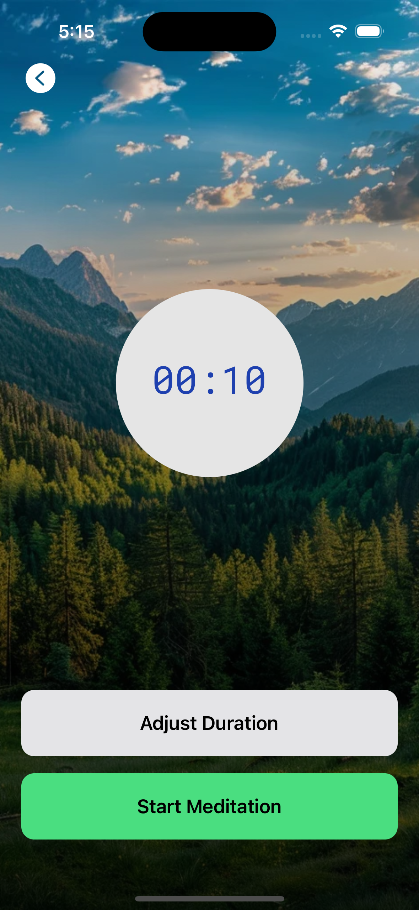

# Meditation App

This is a sample Expo React Native app for demonstrating how to use Tab based navigation and Stack Navigation in one along with the use of expo-av package for playing audio. The Application is simple enough which has the integration of NativeWind Package for leveraging the use of tailwind css for styling the application.

## Screenshots

 
 
 
 
 
 

More Coming soon ...
